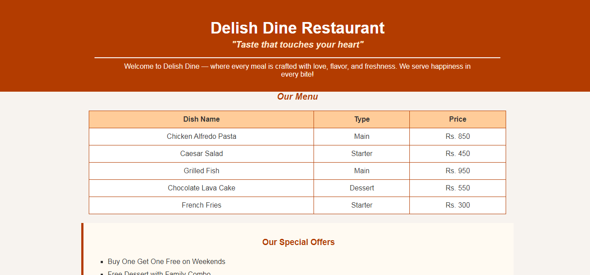

# 🍽️ Delish Dine Restaurant Website

This is a simple restaurant website created using **HTML and CSS** as part of my front-end learning journey.
The project is beginner-friendly and focuses on a clean layout, attractive colors, and basic web structure.

## 📸 Preview

## ✨ Features

* Attractive restaurant landing page
* Clean and simple user interface
* Menu section displayed using tables
* Special offers section
* Contact form for user messages
* Beginner-friendly HTML & CSS code
* Easy to understand and modify

## 🚀 Live Demo

[View the page here](https://sania-arooj.github.io/Delish-Dine-Restaurant/)

## 📂 Technologies Used

* HTML5
* CSS3

## 👩‍💻 Author

**Sania Arooj**
🎓 BSCS Student
💻 Learning Web Development
🌱 Passionate about coding

